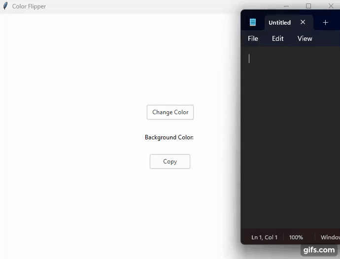

# Simple Color Flipper

Simple Color Flipper using tkinter

App was made following [this](https://www.youtube.com/watch?v=KgoxxRAPRkw&ab_channel=AlinaChudnova) tutorial made by youtuber Alina Chudnova.

### Features

- Randomly generate a hex color value
- Apply color to background and label
- Copy hex value to clipboard

## Demo

## Requirements
- Python 3+
- tkinter
- ttkthemes

## Usage

1. Run 'python main.py'